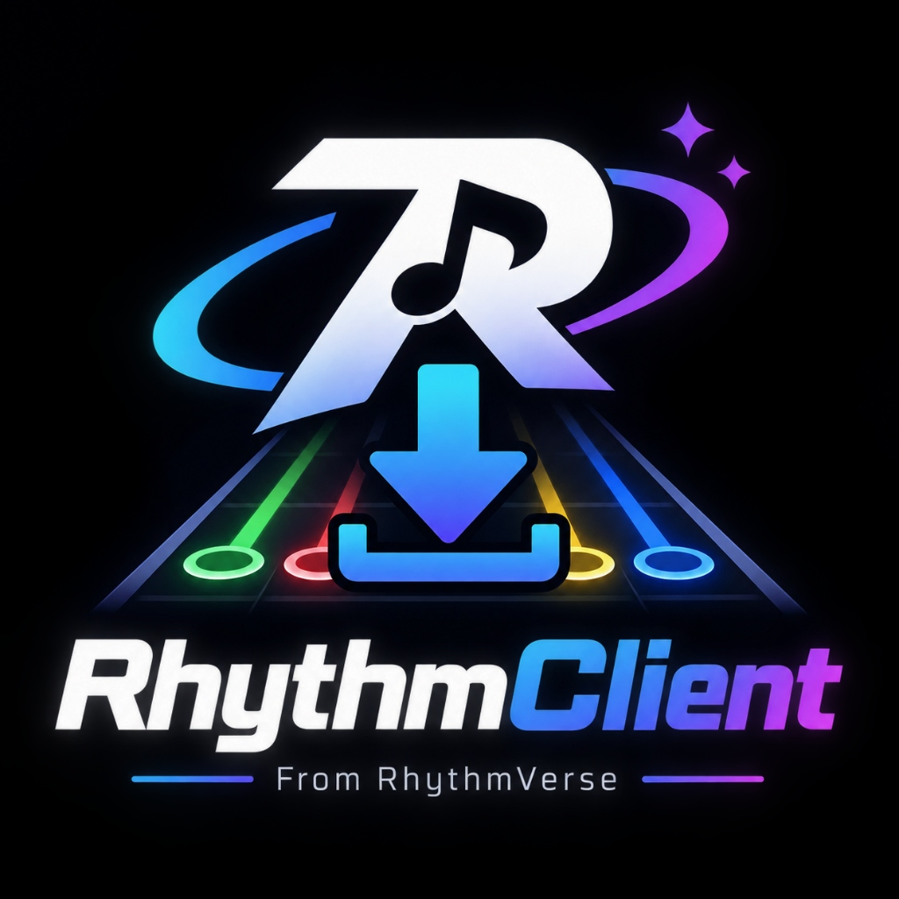
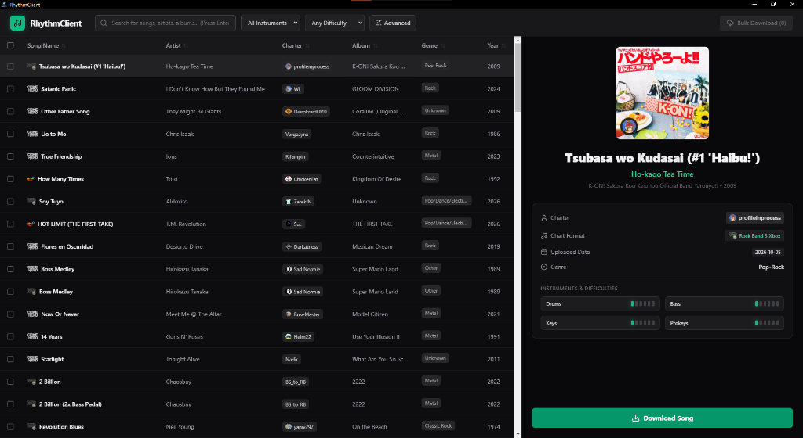
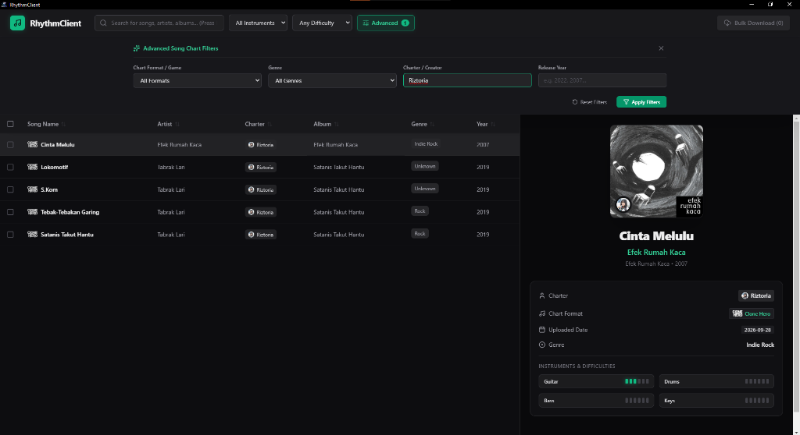

<p align="center">
  
</p>

<h1 align="center">RhythmClient 🎸</h1>

<p align="center">
  <a href="https://github.com/abf524/RhythmClient/releases"></a>
  <a href="https://github.com/abf524/RhythmClient/releases"></a>
  <a href="LICENSE"></a>
  <a href="https://www.electronjs.org/"></a>
</p>

<p align="center">
  <strong>A modern, responsive desktop client inspired by Bridge to browse, search, and bulk-download song charts directly from <a href="https://rhythmverse.co">RhythmVerse</a>.</strong>
</p>

---

## 📥 Download

Grab the latest standalone portable `.exe` from the **[Releases](https://github.com/abf524/RhythmClient/releases)** tab:

- 📦 **[Download RhythmClient v1.0.0 Portable (.exe)](https://github.com/abf524/RhythmClient/releases/latest)** *(No installation required — download and run directly!)*

---

## 📸 Screenshots

<p align="center">
  
  <br>
  <em>Main Browser: Split-view table with album art, instrument difficulties, game format badges, and charter profile icons.</em>
</p>

<br>

<p align="center">
  
  <br>
  <em>Advanced Filters: Query specifically by Game Format, Genre, Charter/Creator, and Release Year with dynamic identity resolution.</em>
</p>

---

## ✨ Features

- **⚡ Real-Time RhythmVerse Database**:
  - Live query directly across thousands of charts for Clone Hero, Rock Band, Guitar Hero, Phase Shift, and YARG.
  - Automatically loads the latest uploaded and updated charts on initial startup.
- **🔍 Advanced Search & Filter System**:
  - Filter by **Game Format** (Clone Hero, Rock Band 3 Xbox/PS3/Wii, Guitar Hero WTDE, Phase Shift, YARG).
  - Filter by **Instrument** (Guitar, Drums, Bass, Vocals, Keys).
  - Filter by **Difficulty** (Warmup to Nightmare).
  - Filter by **Genre**, **Year**, and **Charter Name**.
  - Intelligent charter alias and display name resolution.
- **📊 Multi-Column Table Sorting**:
  - Multi-column sort by Song Title (A–Z / Z–A), Artist, Charter, Year, or Upload Date.
- **💾 Authentic Single & Bulk Downloads**:
  - One-click downloads that retain authentic chart filenames and formats (`.zip`, `.rar`, Xbox `CON` / `_rb3con` packages).
  - Full support for internal file streams as well as external mirrors (MediaFire, Dropbox, Google Drive).
  - **Bulk Download Queue**: Select multiple charts and download them all bundled in a single organized ZIP archive with automatic duplicate naming (`Song (1).zip`).
- **🎨 Modern Dark UI**:
  - Clean split-view design with detailed song cards, difficulty meters, format badges, and charter icons.

---

## 🛠️ Supported Games & Chart Formats

| Format | Game Name | Target File Type |
|---|---|---|
| `ch` / `chm` | **Clone Hero** | `.zip` (Song folder with audio, notes.chart/mid) |
| `rb3xbox` / `rb2xbox` | **Rock Band 3 / 2 (Xbox 360)** | STFS `CON` package / `_rb3con` |
| `rb3ps3` | **Rock Band 3 (PS3)** | `.rar` / `.pkg` |
| `rb3wii` | **Rock Band 3 (Wii)** | `.bin` / `.zip` |
| `wtde` / `gh3pc` | **Guitar Hero WTDE / World Tour** | `.zip` |
| `ps` | **Phase Shift** | `.zip` / `.rar` |
| `yarg` | **YARG (Yet Another Rhythm Game)** | `.zip` |

---

## 💻 Development & Building

### Prerequisites
- [Node.js](https://nodejs.org/) (v18 or higher)
- [npm](https://www.npmjs.com/)

### Clone & Install
```bash
git clone https://github.com/abf524/RhythmClient.git
cd RhythmClient

# Install root dependencies
npm install

# Install frontend dependencies
cd frontend
npm install
cd ..
```

### Running Locally
```bash
# Run backend proxy & dev server
node backend/server.js

# In another terminal, start frontend
cd frontend
npm run dev

# Or launch the Electron app directly
npm start
```

### Building the Portable Windows Executable
```bash
# 1. Compile React production build
npm run build:frontend

# 2. Package into a portable executable
npm run build:exe
```
The output file will be generated in `dist-electron/RhythmClient 1.0.0.exe`.

---

## 📄 License
This project is licensed under the [MIT License](LICENSE).

## 🙏 Acknowledgements
- [RhythmVerse](https://rhythmverse.co) for the incredible community charts database.
- Inspired by the Bridge client and the custom rhythm gaming community.